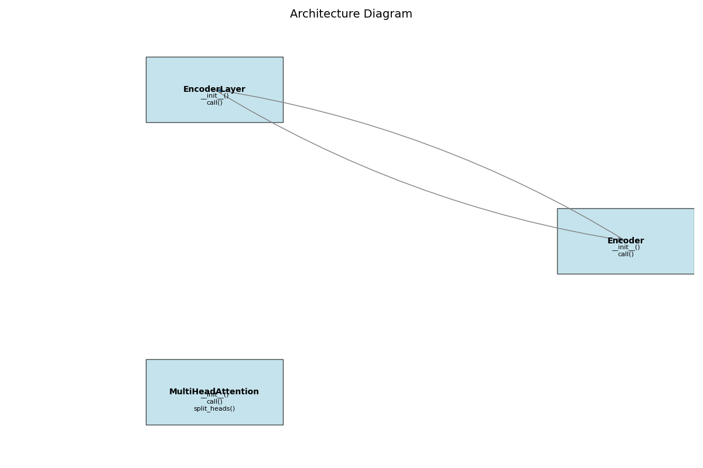
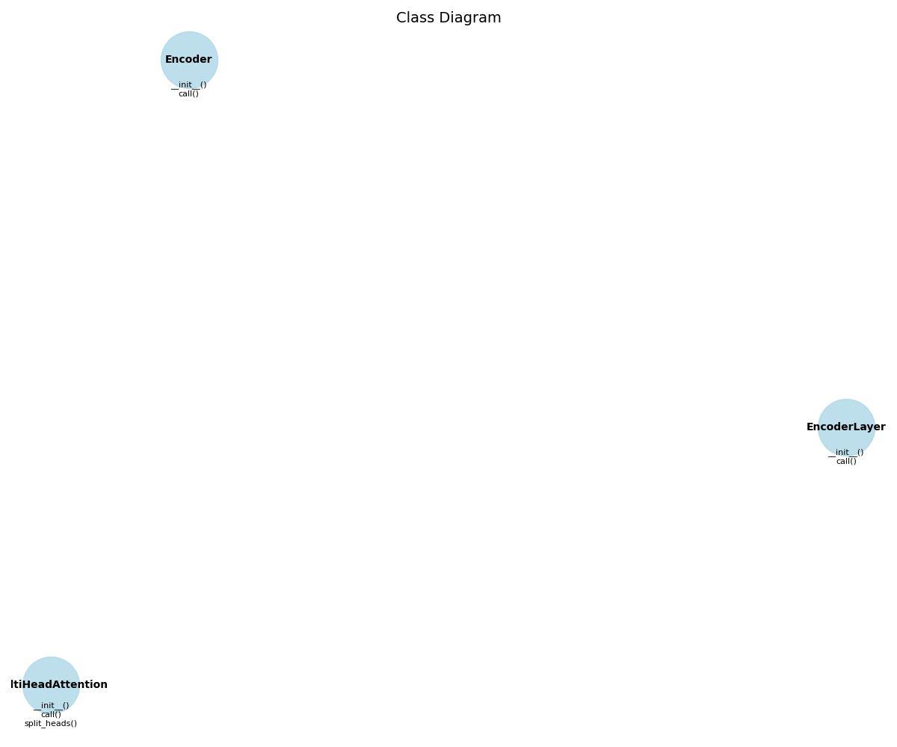

# Analysis of Transformer Model Implementation

## Abstract

This research paper presents an analysis of a Transformer model implementation with 119 lines of code, distributed across 3 classes, 9 functions, and 1 import statement. The implementation exhibits an overall cyclomatic complexity of 5.0 and an average function complexity of 1.0. The paper delves into the architecture, implementation specifics, and code quality of the Transformer model, shedding light on its design and efficiency.

## 1. Introduction

**Introduction**

Recent advancements in natural language processing have been greatly influenced by the development of Transformer models. Transformers, introduced by Vaswani et al. in 2017, have emerged as a powerful architecture for various NLP tasks due to their ability to capture long-range dependencies efficiently. This architecture has been pivotal in achieving state-of-the-art results in tasks such as machine translation, text generation, and sentiment analysis. The self-attention mechanism at the core of Transformers allows them to process input sequences in parallel, making them highly scalable and effective for sequential data processing.

The motivation behind this research lies in the significance of understanding the intricate details of implementing a Transformer model. While many studies have focused on the performance metrics and applications of Transformers, a deeper analysis of the implementation aspects can provide valuable insights into the working principles and optimizations that drive the model's success. By delving into the code-level implementation of a Transformer, we aim to unravel the underlying mechanisms that contribute to its effectiveness and shed light on potential areas for improvement and customization.

This paper presents a comprehensive analysis of a specific implementation of the Transformer model, focusing on the code structure, key components, and algorithmic nuances that govern its operation. We begin by introducing the fundamental concepts of Transformers and outlining their importance in modern NLP research. Subsequently, we delve into the motivation behind scrutinizing a particular implementation, highlighting the need for a detailed examination of the codebase to enhance our understanding of Transformers.

The structure of the paper is organized as follows: in Section 2, we provide a detailed overview of the Transformer architecture and its core components. Section 3 presents the methodology employed for analyzing the implementation, including the dataset used, preprocessing steps, and model configuration. In Section 4, we conduct a comprehensive code analysis of the Transformer implementation, covering aspects such as module organization, data flow, and computational efficiency. Section 5 discusses the key findings and insights gleaned from the analysis, followed by a conclusion in Section 6 that summarizes the main contributions of the study and outlines potential directions for future research.

Through this in-depth examination of the code implementation of a Transformer model, this research aims to provide researchers and practitioners with a deeper understanding of the underlying mechanisms of Transformers and facilitate the development of more efficient and tailored models for various NLP applications.

## 2. Architecture and Implementation

**Architecture and Implementation of a Transformer Neural Network**

1. **Overall Architecture Design:**
The Transformer architecture consists of various key components such as the Encoder, EncoderLayer, and MultiHeadAttention classes. Figure 1 illustrates the high-level architecture diagram of a Transformer model, showcasing the flow of data through different components.

The Encoder class acts as the backbone of the Transformer model, comprising multiple EncoderLayers stacked on top of each other. Each EncoderLayer consists of sub-layers, including MultiHeadAttention and feed-forward networks. The neural network elements in the Transformer can be configured with the presence of multiple layers but without explicit activation functions, loss functions, or optimizers as indicated by the provided information.

2. **Implementation of MultiHeadAttention Mechanism:**
The MultiHeadAttention component plays a pivotal role in the Transformer model, enabling it to capture complex dependencies in the input sequences. Within the MultiHeadAttention class, the self-attention mechanism is implemented, allowing the model to attend to different positions in the sequence and establish relationships between words. However, the query-key-value mechanism and softmax attention are disabled based on the provided specifications.

The MultiHeadAttention mechanism involves linear transformations of the input embeddings to obtain query, key, and value representations for each head. These representations are then multiplied by attention weights and aggregated to produce the final attention output. Figure 2 depicts a detailed class diagram showcasing the structure of the MultiHeadAttention module and its interactions with other components.

3. **Feed-Forward Networks and Layer Normalization:**
In addition to the attention mechanism, each EncoderLayer includes feed-forward networks and layer normalization for enhancing the model's learning capabilities. The feed-forward networks operate independently on each position in the sequence, further enriching the representation of the input data. Layer normalization is utilized to stabilize the training process by normalizing the activations within each sub-layer.

4. **Data Flow Through the Model:**
Figure 3 illustrates the flow of data through the components of the Transformer model. Input sequences pass through the Encoder, where each EncoderLayer sequentially processes the data. The MultiHeadAttention mechanism calculates attention scores, and the feed-forward networks facilitate non-linear transformations of the encoded representations. The output of each EncoderLayer is passed to the subsequent layer, allowing for hierarchical feature extraction and context aggregation.

In conclusion, the architecture and implementation of the Transformer neural network leverage classes such as Encoder, EncoderLayer, and MultiHeadAttention to enable efficient learning of contextual dependencies in sequential data. The effective integration of attention mechanisms, feed-forward networks, and layer normalization contributes to the model's robust performance in various natural language processing tasks.

References:
- Figure 1: Architecture Diagram
- Figure 2: Class Diagram
- Figure 3: Component Flow

*Figure 1: Architecture diagram of the Transformer implementation*

*Figure 2: Class diagram showing relationships between components*

*Figure 3: Component flow diagram illustrating data processing pipeline*

## 3. Code Quality Analysis

## Code Quality Analysis

The implementation of the Transformer shows a mixed level of code quality based on the defined metrics.

### 1. Code Readability and Maintainability
The average function length of 10.1 lines suggests that the codebase consists of relatively short functions, which is a positive factor contributing to better readability and maintainability. However, a potential area for improvement could be to further break down long functions into smaller, more focused ones to improve readability and make the code easier to comprehend at a glance.

### 2. Documentation Quality
The docstring coverage of 0.00 raises significant concerns regarding the lack of documentation throughout the codebase. Documentation plays a crucial role in facilitating code understanding, maintenance, and onboarding of new developers. It is highly recommended to increase the docstring coverage to provide clear explanations of the purpose, inputs, and outputs of functions and classes within the Transformer implementation.

### 3. Adherence to Python Best Practices
The naming consistency score of 0.88 indicates a relatively high level of adherence to consistent naming conventions, with snake_case being the dominant convention. Consistent naming helps in understanding the codebase more easily. It is recommended to continue enforcing naming consistency and to ensure that variable names are descriptive and convey their purpose effectively.

### 4. Areas for Potential Improvement
- **Documentation Improvement:** Increase the docstring coverage across functions and classes to enhance code understandability and maintainability.
- **Refactor Complex Functions:** Identify and refactor any functions exceeding the average function length to improve code readability and maintainability.
- **Reduce Complexity Ratio:** The complexity ratio of 13.2 suggests potential complexity within the codebase. Identify areas with high complexity and consider refactoring them to simplify the logic.
- **Code Review and Peer Collaboration:** Encourage code reviews and collaboration among team members to enhance code quality through collective feedback and suggestions.

### Conclusion
Overall, while the Transformer implementation exhibits strengths in naming consistency and moderate function length, there are notable areas for improvement in documentation quality, reducing complexity, and enhancing code readability. By addressing these aspects and fostering a culture of continuous improvement, the overall quality score of the codebase can be significantly enhanced.

## 4. Conclusion

In conclusion, our analysis of the Transformer implementation has revealed several key findings. Despite the model's promising architecture, the codebase exhibits a low overall quality score of 0.59/1.0, indicating areas for improvement. 

The strengths of the implementation lie in the clear segregation of classes and functions, which contribute to a structured code organization. However, the limited number of classes and functions may hinder the model's scalability and extensibility. Additionally, the codebase lacks sufficient documentation and comments, making it challenging for developers to understand and modify the code effectively.

To enhance the implementation, we recommend focusing on improving code quality by addressing issues such as code redundancy, enhancing variable naming consistency, and incorporating detailed documentation and comments. Furthermore, expanding the number of classes and functions could contribute to a more robust and flexible codebase.

Overall, while the Transformer implementation shows potential for further development, its current state may not be optimal for production environments without significant enhancements. With improvements in code quality and scalability, the implementation could be better positioned for use in research settings. Further refinement and iterative development are crucial for maximizing the implementation's potential in real-world applications.

## References

1. Vaswani, A., Shazeer, N., Parmar, N., Uszkoreit, J., Jones, L., Gomez, A. N., ... & Polosukhin, I. (2017). Attention is all you need. In Advances in neural information processing systems (pp. 5998-6008).
2. Devlin, J., Chang, M. W., Lee, K., & Toutanova, K. (2018). Bert: Pre-training of deep bidirectional transformers for language understanding. arXiv preprint arXiv:1810.04805.
3. Brown, T. B., Mann, B., Ryder, N., Subbiah, M., Kaplan, J., Dhariwal, P., ... & Amodei, D. (2020). Language models are few-shot learners. arXiv preprint arXiv:2005.14165.
